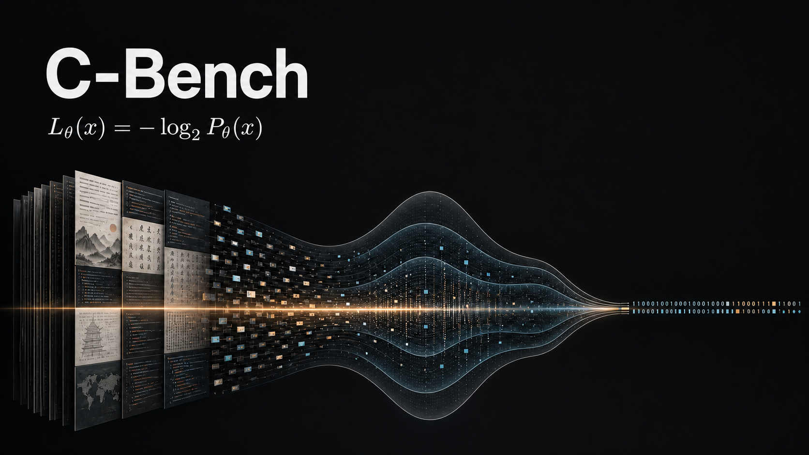
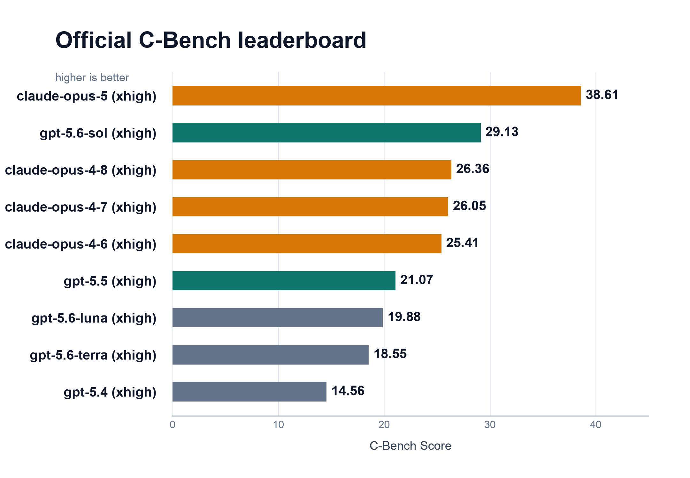

# C-Bench: Measuring Language Models Through Compression



## Principle

**Compression and prediction are deeply equivalent. A better language model is
a better general-purpose predictive compressor.**

For a sequence of tokens, an autoregressive model defines

```math
P_\theta(x) = \prod_{t=1}^{T} P_\theta(x_t \mid x_1,\ldots,x_{t-1})
```

By source coding, its ideal lossless code length and normalized cost are

```math
L_\theta(x) = -\log_2 P_\theta(x)
            = -\sum_{t=1}^{T}\log_2 P_\theta(x_t \mid x_1,\ldots,x_{t-1})
```

```math
\mathrm{BPB}(x) = \frac{L_\theta(x)}{\lvert x\rvert_{\mathrm{bytes}}}
```

Better prediction means fewer bits.

C-Bench applies this principle through black-box continuation prediction. For
each hidden context, a model generates the next passage with tools and retrieval
disabled. The prediction is compared with the true continuation over UTF-8
bytes.

If $s$ is mean continuation similarity across domains, the leaderboard score is

```math
\mathrm{C\text{-}Bench\ Score}
=100\min\left(1,\frac{\log_{10}\left(1/(1-s)\right)}{3}\right).
```

Perfect similarity is defined to score 100. Every tenfold reduction in mismatch
adds 33.3 points: 90% similarity scores 33.3, 99% scores 66.7, and 99.9% scores
100. Higher is better. Exact BPB and four-choice API scoring remain available
as unranked diagnostics.

This repository is a small reference implementation. It releases only the
`public_dev` suite so people can install C-Bench, test the implementation, and
run their own models. Public data is assumed contaminated and is not a serious
leaderboard set.

Official evaluation sets are private and are not included in this repository.
They are reserved for maintainer-controlled, contamination-resistant
leaderboard evaluations. See `docs/public_dev.md` and
`docs/contamination_policy.md`.

## Leaderboards

The only ranking metric is **C-Bench Score**, a log-scaled 0-100 score derived
from macro continuation similarity. Different reasoning-effort settings are
separate entries. Prefix match, exact-match rate, four-choice accuracy, and
exact BPB are supporting diagnostics.

### Official C-Bench Leaderboard

Official cases and answer keys are private and are not published in this
repository. Maintainer-controlled runs use hidden, rotating continuations.



| Rank | Model | Access / setting | C-Bench Score | Similarity | Prefix | Exact | Evidence |
|---:|---|---|---:|---:|---:|---:|---|
| 1 | claude-opus-5 | Claude Code / xhigh | **38.61** | 93.05% | 73.29% | 3/12 | Maintainer run; 12/12 completed |
| 2 | gpt-5.6-sol | OpenAI API / xhigh | **29.13** | 86.63% | 65.51% | 5/12 | Maintainer run; 12/12 completed |
| 3 | claude-opus-4-8 | Claude Code / xhigh | **26.36** | 83.81% | 36.84% | 1/12 | Maintainer run; 12/12 completed |
| 4 | claude-opus-4-7 | Claude Code / xhigh | **26.05** | 83.46% | 50.40% | 1/12 | Maintainer run; 12/12 completed |
| 5 | claude-opus-4-6 | Claude Code / xhigh | **25.41** | 82.71% | 45.48% | 2/12 | Maintainer run; 12/12 completed |
| 6 | gpt-5.5 | Codex CLI / xhigh | **21.07** | 76.67% | 51.21% | 3/12 | Maintainer run; 12/12 completed |
| 7 | gpt-5.6-luna | OpenAI API / xhigh | **19.88** | 74.67% | 41.48% | 0/12 | Maintainer run; 12/12 completed |
| 8 | gpt-5.6-terra | OpenAI API / xhigh | **18.55** | 72.23% | 46.26% | 1/12 | Maintainer run; 12/12 completed |
| 9 | gpt-5.4 | Codex CLI / xhigh | **14.56** | 63.41% | 28.84% | 1/12 | Maintainer run; 12/12 completed |

### Public Leaderboard

This table contains reproducible community submissions evaluated on released
public suites. Public results remain separate from private official evaluations.
Each submission should include the model identity, suite, reasoning and tool
settings, raw continuations, and a verifiable report.
Submit a result through the
[Public Result Submission issue form](https://github.com/GoBenchmark/C-Bench/issues/new?template=public-result.yml).

| Rank | Model | Access / setting | Submitted by | Suite | C-Bench Score | Similarity | Evidence | Status |
|---:|---|---|---|---|---:|---:|---|---|
| 1 | nvidia/nemotron-3-ultra-550b-a55b:free | OpenRouter free / reasoning max 16 tokens | Maintainers | public_dev | **4.47** | 26.58% | [report](docs/submissions/openrouter-2026-07-24/report.md) / [raw](docs/submissions/openrouter-2026-07-24/nemotron-3-ultra-550b-openrouter.predictions.jsonl) | Verified |
| 2 | openai/gpt-oss-20b:free | OpenRouter free / reasoning max 16 tokens | Maintainers | public_dev | **2.23** | 14.27% | [report](docs/submissions/openrouter-2026-07-24/report.md) / [raw](docs/submissions/openrouter-2026-07-24/gpt-oss-20b-openrouter.predictions.jsonl) | Verified |

## Install

Requirements: Python 3.10 or newer.

### 1. Get the code

```bash
git clone https://github.com/GoBenchmark/C-Bench.git
cd C-Bench
```

If you already have the repository, just open a terminal in its directory.

### 2. Create an environment and install C-Bench

```bash
python3 -m venv .venv
source .venv/bin/activate
python -m pip install --upgrade pip
python -m pip install -e .
```

On Windows, activate the environment with `.venv\Scripts\activate` instead.

### 3. Check the installation

```bash
cbench validate --suite configs/public_dev.yaml
```

You should see `Validated 4 entries for suite public_dev`.

### 4. Create model continuations

The released development cases are in
`datasets/public_dev_generation_cases.jsonl`. Give each case's `context` to a
model without showing it the `target`, then save one continuation per line:

```json
{"id":"public_dev_prose_001","continuation":" predicted text"}
```

A complete empty prediction file is included to verify the command; it is not a
model result.

### 5. Calculate the C-Bench Score

```bash
cbench generation-score \
  --cases datasets/public_dev_generation_cases.jsonl \
  --predictions datasets/public_dev_generation_predictions.example.jsonl \
  --suite public_dev_generation \
  --model example-model \
  --reasoning-effort medium \
  --output runs/example-generation-score.json
```

Generate a readable leaderboard report:

```bash
cbench report \
  --inputs runs/example-generation-score.json \
  --output reports/public_dev_generation_report.md
```

The report shows C-Bench Score, its confidence interval, macro similarity,
prefix match, exact-match rate, and domain results.

### Optional API choice diagnostics

The four-choice `cbench api-score` command remains available for black-box
choice experiments, but it does not produce the main leaderboard score.

### Optional exact compression diagnostics

Exact BPB scoring remains available for open-weight causal language models. It
is retained for research and auditing and does not produce a leaderboard entry.

```bash
python -m pip install -e '.[hf]'
```

```bash
cbench score \
  --model hf:gpt2 \
  --suite configs/public_dev.yaml \
  --max-context-tokens 1024 \
  --target-chunk-tokens 256 \
  --output runs/gpt2.json
```

Optional compressor packages can be installed with:

```bash
python -m pip install -e '.[zstd,brotli]'
```

## Submission Policy

Leaderboard submissions must include the model identity, reasoning effort,
suite version, raw continuation file, generated report, and tools/retrieval settings.
Official submissions are rescored against private cases. Public development
scores are kept in the Public Leaderboard and cannot become official results.
